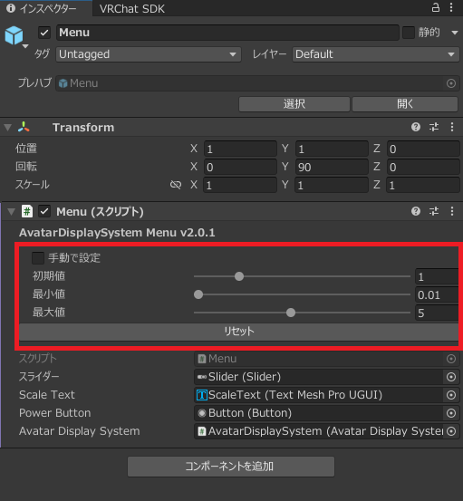

# 機能詳細

## Avatar Display System本体の機能
- スケール変更  
表示する大きさ（スケール）を変更できます。

- ミラーモード  
アバターが自分の方を向くように描画するモードです。言わば三次元ミラーです。  
（製作者より：このモードをオンにするとセリフ撫で出来ます。良いですよ。）

- 表示位置の変更  
アバターの下にあるCubeを動かすとアバターも動きます。水平方向の回転も対応しています。

- 表示切り替え  
左上の電源ボタンで切り替えられます。  
また、DisplayLocationの表示を切り替えることによって、連動して切り替わります。

## メニューの機能
スケールの最大・最小値の変更や、スケールの初期値を設定できます。これらの設定はインスペクター上で行います。
