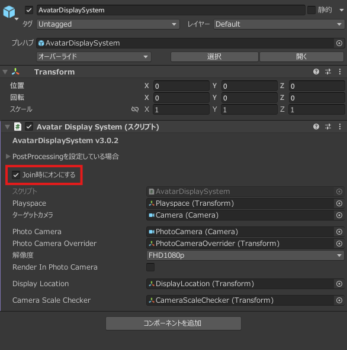
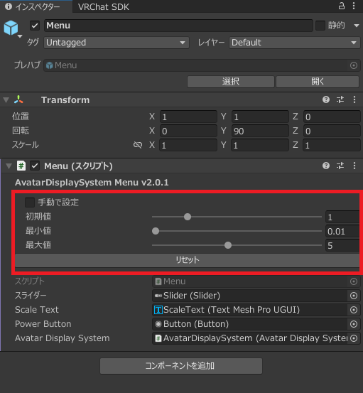

# 機能詳細

## Avatar Display System本体の機能
#### スケール変更
- 表示する大きさ（スケール）を変更できます。メニューから変更できるのはもちろん、Udonを使って柔軟に変更することもできます。

#### ミラーモード
- アバターが自分の方を向くように描画するモードです。言わば三次元ミラーです。
 （製作者より：このモードをオンにするとセリフ撫で出来ます。）

#### 表示位置の変更
- アバターの下にある台座を動かすとアバターも動きます。水平方向の回転も対応しています。

#### 表示切り替え
- 左上の電源ボタンで切り替えられます。
- DisplayLocationの表示を切り替えることによって、連動して切り替わります。
- インスペクターの「Join時にオンにする」トグルで、Join時の挙動を設定できます。

#### 「カメラにも映す」機能
- VRChatの手持ちカメラにもアバターを映せます。
- `render In Photo Camera`をオンにすると、Join時からオンになります。
- `resolution`を変更すると、手持ちカメラに映るアバターの解像度を変更できます。解像度が高いほど、手持ちカメラに映るアバターが綺麗になりますが、描画負荷も上がります。

|名前|解像度|描画負荷|
|---|---|---|
|HD720p|1280x720|低|
|FHD1080p|1920x1080|中|
|QHD1440p|2560x1440|高|
|UHD2160p|3840x2160|非常に高|

## メニューの機能
スケールの最大・最小値の変更や、スケールの初期値を設定できます。これらの設定はインスペクター上で行います。
  
**初期値** Join時のアバターの倍率です。デフォルトは1倍です。  
**最小値** スライダーで変更できる倍率の最小値です。  
**最大値** スライダーで変更できる倍率の最大値です。  
