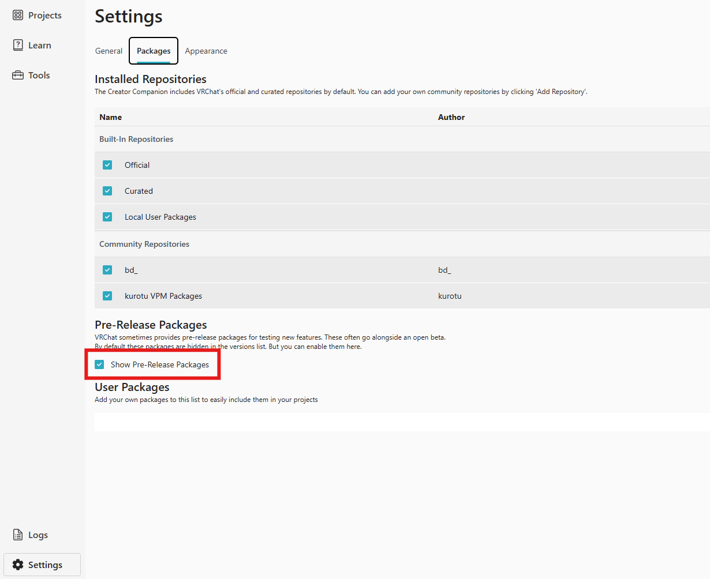
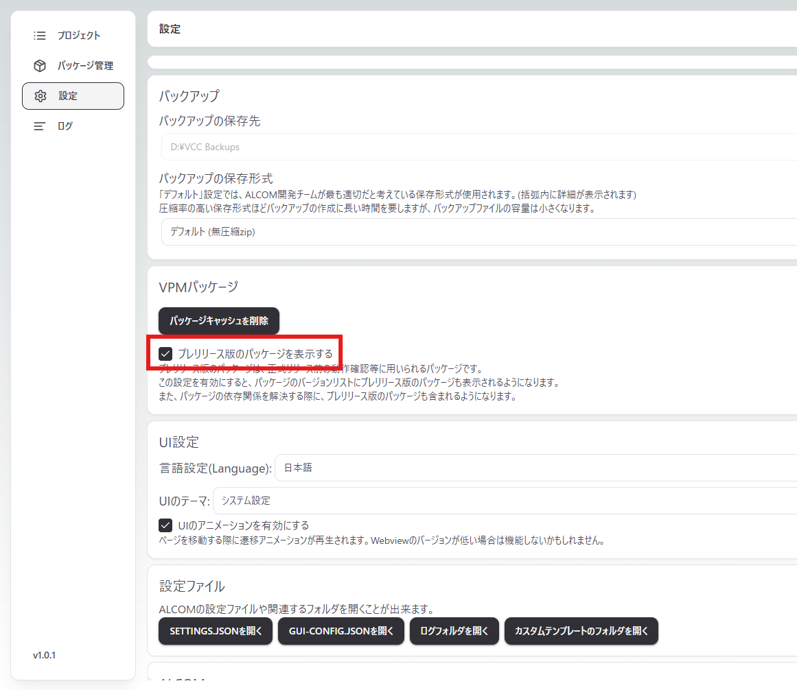

# トラブルシューティング

## ビルド出来ない！
・v2.0.0以上ではSDK 3.8.1以上が必要です。2025/05/10現在はベータ版ですのでVCCやALCOMの設定からプレリリースパッケージを許可してください。
### VCCの場合

### ALCOMの場合

## アバターの断面図が見える！
・v2.0.0以上にアップデートしてください。

## アバターの一部パーツが消える！
・アバターのBoundsが統一されているかご確認ください。Modular Avatarの[Mesh Settings](https://modular-avatar.nadena.dev/ja/docs/reference/mesh-settings)などの一括設定ツールを使うと便利です。